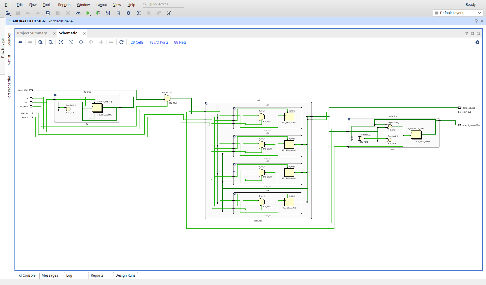
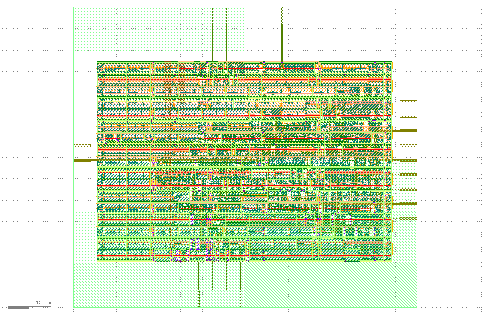

# DFT Workshop

A simple BIST enabled register designed and implemented through a full RTL-to-GDSII flow using OpenLane 2 on the SkyWater SKY130 PDK. Built as a learning exercise in digital ASIC design and DFT concepts.

---

## Detailed Netlist (Viavdo)

---

## GSDII Layout

---

## Physical Specifications

| Parameter | Value |
|-----------|-------|
| Technology | SkyWater SKY130 HD |
| Die Area | 80 x 70 um (5,600 um2) |
| Core Area | 68.54 x 46.24 um (3,169 um2) |
| Core Utilization | 33.52% |
| Standard Cell Area | 1,184.89 um2 |
| Total Wirelength | 1,371 um |
| Total Vias | 433 |
| DRC Errors | 0 |
| LVS Errors | 0 |
| Antenna Violations | 0 |

---

## Timing Specifications

Target clock period: 2.0 ns (500 MHz). Hold is clean across all corners with zero violations.
Setup timing is currently passing at TT and FF corners but failing at the SS corner -- see Known Issues.

| Corner | Voltage | Temp | Setup Slack (ns) | Hold Slack (ns) |
|--------|---------|------|------------------|-----------------|
| TT | 1.80V | 25C | +0.252 | +0.134 |
| SS | 1.60V | 100C | -0.784 | +0.307 |
| FF | 1.95V | -40C | +0.635 | +0.093 |

---

## Power Specifications

Nominal corner: TT, 25C, 1.80V.

| Component | Power |
|-----------|-------|
| Internal | 1,219 uW |
| Switching | 814 uW |
| Leakage | ~0.002 uW |
| Total | ~2,033 uW |

Worst IR drop on VPWR: 2.44 mV.

> Note: Power is currently elevated due to an aggressive synthesis strategy being evaluated.
---

## Known Issues

**SS corner setup violations (active).** This is currently in progress.

**Elevated power consumption (active).** Switching to SYNTH_STRATEGY DELAY 3 caused an 18x increase in power (from ~104 uW to ~2 mW) with no improvement in timing, hence reverted back to AREA 0.

**Low core utilization (~33%).** The die area is oversized for the current logic. Will be addressed after timing closure.

**Three lint warnings.** Minor RTL warnings from synthesis. Under investigation.

## References

- [OpenLane 2 Documentation](https://openlane2.readthedocs.io/)
- [SkyWater SKY130 PDK](https://github.com/google/skywater-pdk)
